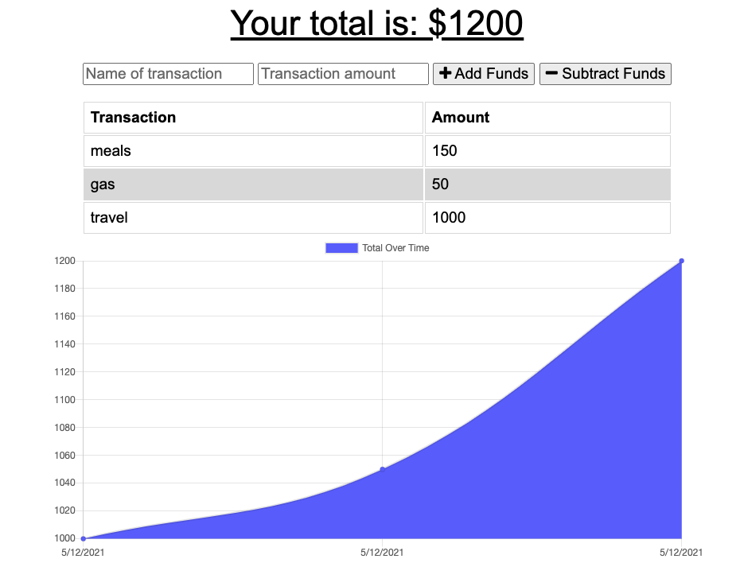

# Budget Tracker

### Languages and Tools:

 
 
 
 

 
 
 
 

 

---
  ## Description
  Budget Tracker is a simple Progressive Web App (PWA) that allows a user to budged their spending. The unique thing about this app is that a user can add expenses and deposits even without an internet/data connection. I was able to achieve this offline capability by incorporating PWA tools like Manifest, Service Worker, and IndexedDB storage. This app was a project in my Coding Bootcamp
## Table of Contents 
  * [Installation](#installation)
  * [Usage](#usage)
  * [Questions](#questions)
  ## Installation 
  Access deployed Heroku website at: https://guarded-sierra-97957.herokuapp.com/
  ## Usage 
  This app can be used by anyone online or offline to budged their spending. 
  ## Questions? 
  Contact me by email listed on https://github.com/spclk

